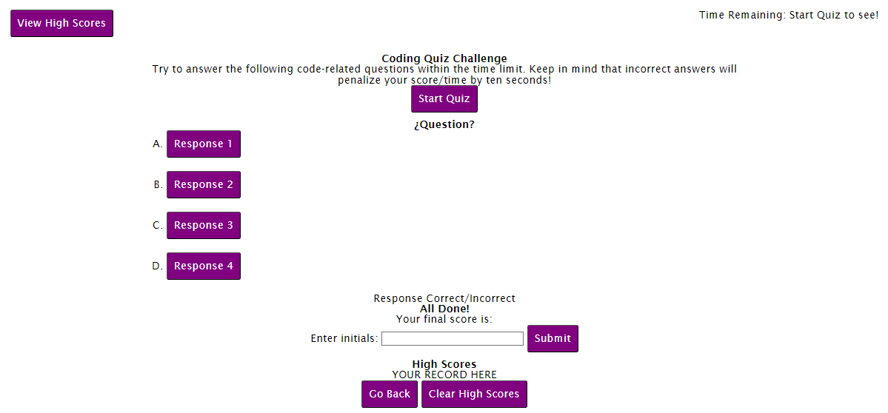
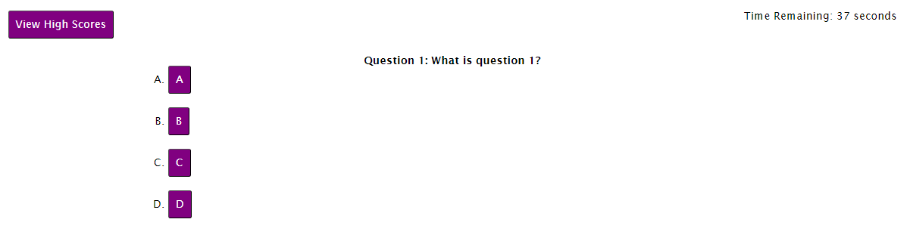

# Coding Quiz
A timed coding quiz with multiple choice questions

## Purpose
Create a site with multiple choice coding quiz questions. Include a timer and score tracker.

## Deployed Webpage Link
https://jabrams513.github.io/coding-quiz/

## User Story

AS A coding boot camp student

I WANT to take a timed quiz on JavaScript fundamentals that stores high scores

SO THAT I can gauge my progress compared to my peers

## Acceptance Criteria

GIVEN I am taking a code quiz

WHEN I click the start button

THEN a timer starts and I am presented with a question

WHEN I answer a question

THEN I am presented with another question

WHEN I answer a question incorrectly

THEN time is subtracted from the clock

WHEN all questions are answered or the timer reaches 0

THEN the game is over

WHEN the game is over

THEN I can save my initials and score

## Screenshot
Please refer to the following screenshot as a reference for the web application's appearance and functionality:

## Code Sources and Collaborators
I had the opportunity to collaborate with my peer Mustapha. We checked our work with one another.

In addition, I received feedback from my instructor, Diego, my TA, Andrew, as well as my tutor, Corey.

All code used was self-generated or otherwise gathered from class materials.